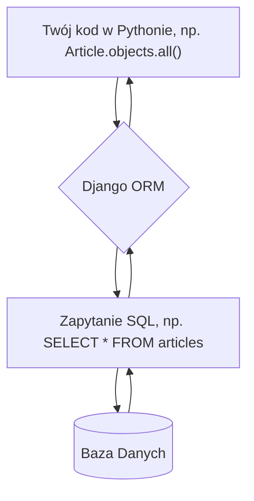
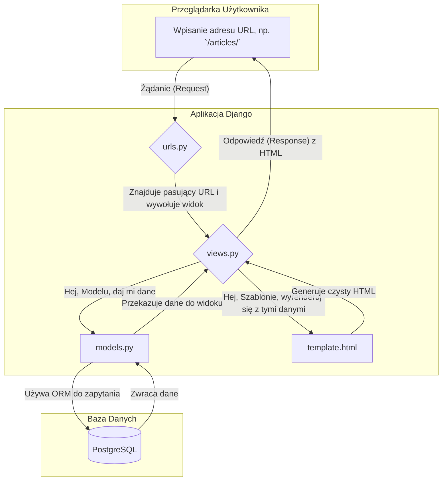

# **Lekcja 21: Praca z aplikacją Django - ORM i Szablony**

`#lekcja` `#python` `#django` `#orm` `#jinja2` `#webdev`

W tej lekcji zagłębimy się w dwa kluczowe elementy frameworka Django: system **ORM** do interakcji z bazą danych oraz **system szablonów** (bardzo podobny do Jinja2), który pozwala dynamicznie generować strony HTML. Nauczymy się, jak pobierać, tworzyć i modyfikować dane bez pisania ani jednej linijki SQL oraz jak prezentować te dane użytkownikowi w przeglądarce.

## **1. Django ORM – Rozmowa z bazą danych w języku Python**

W poprzednich lekcjach, pracując z bazami danych, pisaliśmy zapytania SQL. Django wprowadza potężne narzędzie, które pozwala nam zapomnieć o SQL-u w większości przypadków.

> [!definition]
> 
> ORM (Object-Relational Mapping) to technika programowania, która pozwala na interakcję z relacyjną bazą danych (jak PostgreSQL) za pomocą obiektów, klas i metod języka programowania (w naszym przypadku Pythona). Zamiast pisać SELECT * FROM articles;, piszemy pythonowy kod Article.objects.all(). Django ORM tłumaczy nasz kod Pythona na zapytania SQL.

Główne zalety ORM to:

- **Szybkość rozwoju**: Piszemy kod w Pythonie, który jest często krótszy i bardziej czytelny niż SQL.
    
- **Bezpieczeństwo**: ORM automatycznie chroni nas przed atakami typu SQL Injection.
    
- **Niezależność od bazy danych**: Ten sam kod Pythona będzie działał z PostgreSQL, MySQL czy SQLite.
    
- **Wygoda**: Pracujemy z danymi jak ze zwykłymi obiektami Pythona.
    



### **Przykłady użycia Django ORM**

Załóżmy, że mamy model `Article` zdefiniowany w `models.py`:

```python
# models.py
from django.db import models

class Article(models.Model):
    title = models.CharField(max_length=200)
    content = models.TextField()
    pub_date = models.DateTimeField(auto_now_add=True)

    def __str__(self):
        return self.title
```

> [!note]
> 
> Każdy model w Django (klasa dziedzicząca po models.Model) ma automatycznie dodawany menedżer o nazwie objects. To właśnie przez niego wykonujemy wszystkie operacje na bazie danych.

Przykład 1: Pobieranie wszystkich obiektów

Aby pobrać wszystkie artykuły z bazy danych, używamy metody all().

```python
# views.py
from .models import Article

# Pobierz wszystkie obiekty (rekordy) z modelu Article
all_articles = Article.objects.all()

# Możemy teraz iterować po wynikach
for article in all_articles:
    print(article.title)
```

Przykład 2: Tworzenie nowego obiektu

Nowe rekordy w bazie danych tworzymy za pomocą metody create().

```python
# views.py lub konsola `manage.py shell`
from .models import Article

# Stworzenie nowego artykułu i zapisanie go w bazie danych
# To jest odpowiednik polecenia INSERT INTO w SQL
new_article = Article.objects.create(
    title="Nowy artykuł o Django",
    content="Treść artykułu o potędze ORM."
)

print(f"Utworzono artykuł o ID: {new_article.id}")
```

Przykład 3: Filtrowanie i pobieranie obiektów

Do wyszukiwania obiektów spełniających określone warunki służy metoda filter(). Możemy też pobrać jeden, konkretny obiekt za pomocą get().

```python
# views.py
from .models import Article

# Pobierz artykuły, których tytuł zawiera słowo "Django"
# (case-sensitive)
django_articles = Article.objects.filter(title__contains="Django")

# Pobierz DOKŁADNIE JEDEN artykuł o ID = 1
# Jeśli nie zostanie znaleziony lub zostanie znalezionych więcej, rzuci wyjątkiem!
try:
    specific_article = Article.objects.get(id=1)
    print(f"Znaleziono artykuł: {specific_article.title}")

    # Aktualizacja pola i zapisanie zmian
    specific_article.title = "Zaktualizowany tytuł"
    specific_article.save() # Metoda save() zapisuje zmiany w bazie
except Article.DoesNotExist:
    print("Artykuł o ID 1 nie istnieje.")

```

> [!tip]
> 
> Django ORM oferuje bogaty zestaw "lookups" do filtrowania, np. __exact, __iexact (case-insensitive), __contains, __icontains, __gt (greater than), __lt (less than) i wiele innych.

## **2. Szablony Django – Dynamiczne strony HTML**

Szablony pozwalają nam oddzielić logikę aplikacji (kod w Pythonie) od warstwy prezentacji (kod HTML). Silnik szablonów Django przetwarza plik HTML, w którym umieszczamy specjalne znaczniki, i "wstrzykuje" w nie dane przekazane z widoku.

> [!info]
> 
> Składnia silnika szablonów Django (Django Template Language - DTL) jest bardzo podobna do popularnego silnika Jinja2, którego używaliśmy z Flaskiem. Główne koncepcje są identyczne: zmienne w {{ ... }}, a logika (pętle, warunki) w . Znajomość Jinja2 sprawia, że praca z szablonami Django jest bardzo intuicyjna.

### **Jak podłączyć szablon w Django? (3 kroki)**

Proces wyświetlania dynamicznej strony HTML jest zawsze taki sam:

1. **Stworzenie pliku HTML**: W katalogu `templates` naszej aplikacji tworzymy plik, np. `article_list.html`.
    
2. **Stworzenie widoku (view)**: W pliku `views.py` piszemy funkcję, która pobiera dane (np. z modelu) i "renderuje" szablon, przekazując do niego te dane.
    
3. **Podłączenie widoku pod URL**: W pliku `urls.py` tworzymy ścieżkę, która mapuje konkretny adres URL na nasz widok.
    




![[Screenshot 2025-09-10 at 21.44.15.png]]


**Przykład krok po kroku:**

**Krok 1: Szablon `templates/articles/article_list.html`**

```python
<!DOCTYPE html>
<html lang="pl">
<head>
    <meta charset="UTF-8">
    <title>Lista Artykułów</title>
</head>
<body>
    <h1>Wszystkie artykuły</h1>
    
    
        <ul>
            
                <li>
                    <h2>{{ article.title }}</h2>
                    <p>Opublikowano: {{ article.pub_date|date:"d.m.Y" }}</p>
                </li>
            
        </ul>
    
        <p>Brak artykułów do wyświetlenia.</p>
    
</body>
</html>
```

> W powyższym szablonie użyliśmy:
> 
> - Zmiennej `{{ article.title }}` do wyświetlenia tytułu.
>     
> - Pętli `` do iteracji po liście.
>     
> - Instrukcji warunkowej `` do sprawdzenia, czy lista nie jest pusta.
>     
> - Filtra `|date:"d.m.Y"`, który formatuje datę.
>     

**Krok 2: Widok `articles/views.py`**

```python
from django.shortcuts import render
from .models import Article

def article_list_view(request):
    # Pobieramy wszystkie artykuły z bazy
    all_articles = Article.objects.all().order_by('-pub_date') # sortujemy od najnowszych
    
    # Tworzymy "kontekst" - słownik danych do przekazania do szablonu
    context = {
        'articles': all_articles,
    }
    
    # Renderujemy szablon, przekazując obiekt request i kontekst
    return render(request, 'articles/article_list.html', context)
```

**Krok 3: URL `articles/urls.py`**

```python
from django.urls import path
from .views import article_list_view

urlpatterns = [
    path('', article_list_view, name='article-list'),
]
```

Teraz, wchodząc na odpowiedni adres URL, zobaczymy dynamicznie wygenerowaną listę artykułów.

## **3. Pliki statyczne (CSS, JS, Obrazki)**

Pliki statyczne to zasoby, które nie zmieniają się dynamicznie, takie jak arkusze stylów CSS, skrypty JavaScript czy obrazki. Django ma wbudowany mechanizm do zarządzania nimi.

**Konfiguracja:**

1. Upewnij się, że `django.contrib.staticfiles` jest w `INSTALLED_APPS` w `settings.py`.
    
2. W `settings.py` ustaw `STATIC_URL`, np. `STATIC_URL = '/static/'`.
    
3. W katalogu aplikacji stwórz podkatalog `static`, a w nim kolejny z nazwą aplikacji, np. `my_app/static/my_app/style.css`.
    

Użycie w szablonie:

Aby odwołać się do pliku statycznego, używamy znacznika .

```python
 <!-- Załaduj bibliotekę znaczników static na górze szablonu -->

<!DOCTYPE html>
<html>
<head>
    <title>Strona ze stylami</title>
    <!-- Link do pliku CSS -->
    <link rel="stylesheet" href="">
</head>
<body>
    <h1>Ta strona ma styl!</h1>
    
    <!-- Przykład użycia obrazka -->
    
</body>
</html>
```

## **4. Moduły i aplikacje wielokrotnego użytku**

Ekosystem Django jest ogromny. Istnieją tysiące gotowych "aplikacji", które możemy podłączyć do naszego projektu, aby dodać nową funkcjonalność bez pisania jej od zera (np. system rejestracji użytkowników, rozbudowane galerie zdjęć).

**Jak zainstalować zewnętrzną aplikację?**

1. **Instalacja przez pip**: `pip install nazwa-pakietu` (np. `pip install django-crispy-forms`).
    
2. **Rejestracja w projekcie**: Dodaj nazwę aplikacji (znajdziesz ją w dokumentacji pakietu) do listy `INSTALLED_APPS` w pliku `settings.py`.
    

```python
# settings.py
INSTALLED_APPS = [
    'django.contrib.admin',
    'django.contrib.auth',
    'django.contrib.contenttypes',
    'django.contrib.sessions',
    'django.contrib.messages',
    'django.contrib.staticfiles',
    
    # Moje aplikacje
    'articles.apps.ArticlesConfig',
    
    # Zewnętrzne aplikacje
    'crispy_forms',
]
```

## **🧪 Zadania do samodzielnej pracy**

### **Zadania proste**

1. ✏️ Zadanie 1 – Nowy model
    
    Stwórz w swojej aplikacji nowy model o nazwie Category z jednym polem name typu CharField. Następnie wygeneruj i wykonaj migracje, aby stworzyć odpowiednią tabelę w bazie danych.
    
    (proste)
    
2. ✏️ Zadanie 2 – Dodawanie danych
    
    Używając konsoli Django (python manage.py shell), stwórz 3 różne obiekty modelu Category (np. "Sport", "Technologia", "Kultura") i zapisz je w bazie danych.
    
    (proste)
    
3. ✏️ Zadanie 3 – Podstawowy widok i szablon
    
    Napisz widok, który pobierze wszystkie obiekty Category z bazy. Stwórz prosty szablon HTML, który wyświetli nazwy wszystkich kategorii w formie listy nieuporządkowanej (<ul>). Podłącz widok pod adres URL /categories/.
    
    (proste)
    
4. ✏️ Zadanie 4 – Plik statyczny CSS
    
    Stwórz plik style.css w odpowiednim katalogu static. Dodaj do niego regułę, która zmienia kolor tła strony (body { background-color: #f0f8ff; }). Podłącz ten plik CSS do szablonu z listą kategorii.
    
    (proste)
    
5. ✏️ Zadanie 5 – Filtrowanie w shellu
    
    W konsoli Django (shell) napisz zapytanie ORM, które pobierze tylko kategorię o nazwie "Sport". Użyj metody get().
    
    (proste)
    

### **Zadania "Challenge"**

6. 🧠 Zadanie 6 – Widok szczegółów
    
    Stwórz nowy widok category_detail_view, który będzie przyjmował w URL-u ID kategorii (np. /categories/1/). Widok powinien pobrać z bazy danych tylko ten jeden, konkretny obiekt Category i przekazać go do nowego szablonu category_detail.html, który wyświetli jego nazwę w nagłówku <h1>.
    
    Wskazówka: path('categories/<int:pk>/', ...) w urls.py i def my_view(request, pk): ... w views.py.
    
    (challenge)
    
7. 🧠 Zadanie 7 – Relacja i wyświetlanie
    
    Zmodyfikuj model Article, dodając do niego pole category typu ForeignKey do modelu Category (on_delete=models.CASCADE). Przypisz w shellu każdemu artykułowi jakąś kategorię. Następnie zmodyfikuj szablon category_detail.html tak, aby pod nazwą kategorii wyświetlał listę wszystkich artykułów należących do tej kategorii.
    
    Wskazówka: Po stworzeniu relacji, z obiektu kategorii możesz odwołać się do powiązanych artykułów przez category.article_set.all().
    
    (challenge)
    
8. 🧠 Zadanie 8 – Logika warunkowa w szablonie
    
    Dodaj do modelu Article pole is_published typu BooleanField z default=True. W widoku listy artykułów pobieraj tylko te, które są opublikowane (is_published=True). W szablonie article_list.html dodaj obok tytułu każdego artykułu napis "NOWOŚĆ!" (np. w <span>), ale tylko jeśli artykuł został opublikowany w ciągu ostatnich 3 dni.
    
    Wskazówka: Możesz potrzebować niestandardowego tagu szablonu lub przekazać dodatkową informację z widoku. Prostsze rozwiązanie: użyj wbudowanego filtra timesince lub timeuntil.
    
    (challenge)
    
9. 🧠 Zadanie 9 – Zmiana w panelu admina
    
    Domyślnie tytuł w panelu admina to "Django administration". Znajdź w internecie, jak nadpisać szablon admin/base.html, aby zmienić ten tytuł na "Panel Administratora Mojej Strony".
    
    (challenge)
    
10. 🧠 Zadanie 10 – Prosty formularz wyszukiwania
    
    W szablonie listy artykułów (article_list.html) dodaj prosty formularz HTML (<form method="GET"> ... </form>) z jednym polem <input type="text" name="q">. W widoku article_list_view sprawdź, czy w żądaniu GET istnieje parametr q (request.GET.get('q')). Jeśli tak, przefiltruj artykuły, aby pokazać tylko te, których tytuł zawiera szukaną frazę.
    
    (challenge)