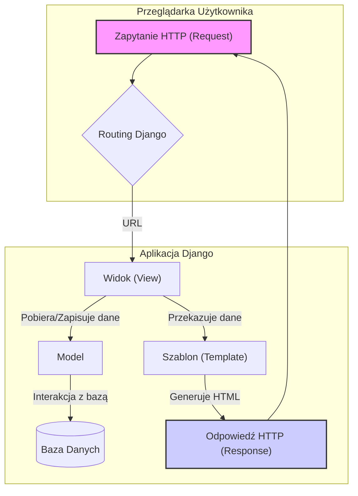
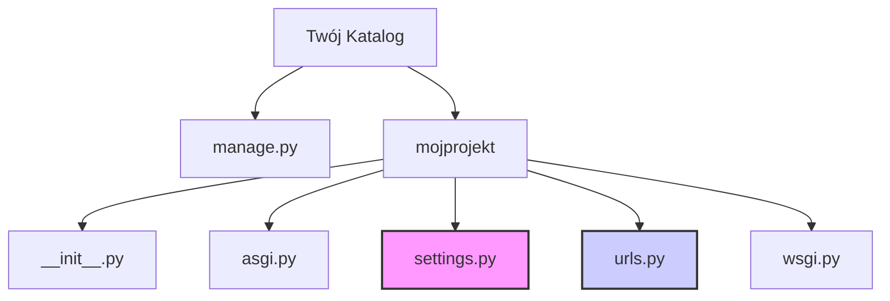
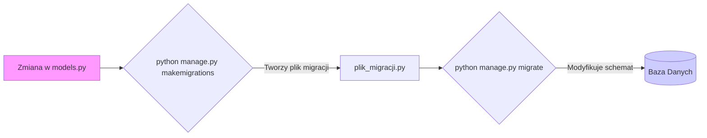
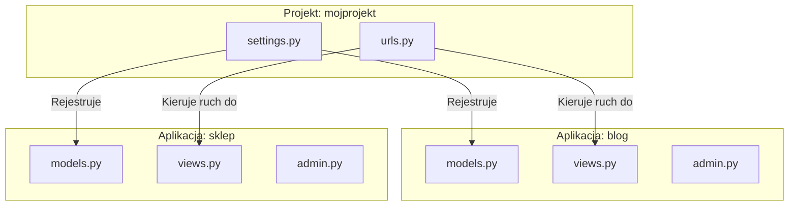

# **Lekcja 19: Wprowadzenie do Django**

`#lekcja` `#python` `#django` `#webdev` `#framework` `#backend`

Witaj w świecie Django! Po zapoznaniu się z podstawami web developmentu i frameworkiem Flask, czas na kolejny krok. W tej lekcji poznamy Django – potężny framework webowy napisany w Pythonie, który pozwala na szybkie tworzenie bezpiecznych i skalowalnych aplikacji internetowych. Skupimy się na strukturze projektu, konfiguracji, zarządzaniu bazą danych i wbudowanym panelu administratora.

## **1. Czym jest Django?**

> [!definition]
> 
> Django to darmowy framework webowy open-source, napisany w Pythonie, który stosuje wzorzec architektoniczny Model-View-Template (MVT). Jego główną filozofią jest "Batteries Included" (baterie w zestawie), co oznacza, że dostarcza on ogromną liczbę gotowych narzędzi do typowych zadań, takich jak uwierzytelnianie użytkowników, obsługa bazy danych, panel administracyjny czy formularze.

Django zostało stworzone, aby deweloperzy mogli skupić się na pisaniu unikalnej logiki swojej aplikacji, zamiast wymyślać koło na nowo. Jest używane przez takie firmy jak Instagram, Spotify czy Pinterest.

Wzorzec MVT w Django jest bardzo podobny do poznanego już przez Ciebie wzorca MVC:

- **Model**: Odpowiada za strukturę danych i logikę biznesową. Definiuje, jak dane są przechowywane w bazie danych i jak można nimi manipulować.
    
- **View (Widok)**: W Django widok to funkcja lub klasa, która przyjmuje zapytanie HTTP i zwraca odpowiedź HTTP. To tutaj znajduje się logika aplikacji – widok pobiera dane z Modelu, przetwarza je i przekazuje do Szablonu.
    
- **Template (Szablon)**: Odpowiada za warstwę prezentacji. Jest to plik (zazwyczaj HTML) z dodatkową składnią Django, która pozwala na dynamiczne wstawianie danych przekazanych z Widoku.
    



MVT flow:
`Request → View → Model → View → Template → Response`

## **2. Konfiguracja projektu Django**

Rozpoczęcie pracy z Django jest bardzo proste. Najpierw musimy zainstalować sam framework.

> [!info]
> 
> Upewnij się, że masz aktywne środowisko wirtualne (virtualenv), które stworzyliśmy na wcześniejszych lekcjach. To dobra praktyka, aby izolować zależności każdego projektu.

Instalacja Django:

```bash
pip install django
```

Po instalacji możemy stworzyć nasz pierwszy projekt.

```bash
# Przykład 1: Tworzenie nowego projektu Django
# Używamy komendy 'django-admin startproject', po której podajemy nazwę projektu.
# Kropka na końcu '.' oznacza, że projekt zostanie utworzony w bieżącym katalogu,
# co pozwala uniknąć dodatkowego zagnieżdżenia folderów.

django-admin startproject mojprojekt .
```

Po wykonaniu tej komendy, struktura Twojego katalogu będzie wyglądać następująco:




![[Screenshot 2025-08-25 at 15.53.33.png]]

> [!note]
> 
> Najważniejsze pliki w projekcie Django:
> 
> - **`manage.py`**: Główne narzędzie do zarządzania projektem z linii komend. Użyjemy go do uruchamiania serwera, tworzenia aplikacji, migracji bazy danych i wielu innych.
>     
> - **`mojprojekt/settings.py`**: Plik konfiguracyjny projektu. Tutaj podłączymy bazę danych, dodamy aplikacje, skonfigurujemy ścieżki do plików statycznych itp.
>     
> - **`mojprojekt/urls.py`**: Główny plik routingu. Definiuje, który widok ma zostać uruchomiony dla danego adresu URL.
>     

## **3. Podłączenie do PostgreSQL**

Django domyślnie używa lekkiej bazy danych SQLite, która jest świetna do nauki i małych projektów. W bardziej zaawansowanych aplikacjach chcemy jednak korzystać z potężniejszych systemów, takich jak PostgreSQL.

> [!definition]
> 
> Aby połączyć Django z PostgreSQL, potrzebujemy "adaptera" – biblioteki, która tłumaczy zapytania Pythona na język zrozumiały dla bazy danych. Najpopularniejszym adapterem jest psycopg2.

Zainstalujmy go:

```bash
# Zalecana jest wersja binarna, która nie wymaga dodatkowych kompilacji
pip install psycopg2-binary
```

Teraz musimy zaktualizować konfigurację w pliku `settings.py`.

```python
# Przykład 2: Konfiguracja bazy danych PostgreSQL w settings.py
# Znajdź sekcję DATABASES i zastąp domyślną konfigurację SQLite.

DATABASES = {
    'default': {
        'ENGINE': 'django.db.backends.postgresql', # Informuje Django, że używamy PostgreSQL
        'NAME': 'nazwa_bazy_danych',              # Nazwa Twojej bazy danych
        'USER': 'nazwa_uzytkownika',             # Użytkownik bazy danych
        'PASSWORD': 'twoje_haslo',               # Hasło do bazy danych
        'HOST': 'localhost',                     # Adres serwera bazy danych (zazwyczaj localhost)
        'PORT': '5432',                          # Domyślny port PostgreSQL
    }
}
```

> [!tip]
> 
> Pamiętaj, że dane logowania do bazy danych są wrażliwe. W prawdziwych projektach nie przechowuje się ich bezpośrednio w kodzie, lecz używa zmiennych środowiskowych lub specjalnych plików konfiguracyjnych, które są ignorowane przez system kontroli wersji (Git).

## **4. Komendy `manage.py`**

Plik `manage.py` to nasze centrum dowodzenia. Używamy go, wywołując polecenia z terminala w głównym katalogu projektu.

> [!definition]
> 
> manage.py to skrypt Pythona, który automatycznie opakowuje komendy administracyjne Django, pozwalając na interakcję z projektem bez konieczności edycji plików konfiguracyjnych za każdym razem.

Oto kilka najważniejszych komend:

```bash
# Przykład 1: Uruchomienie serwera deweloperskiego
# Ta komenda uruchamia lekki serwer webowy na Twoim komputerze,
# domyślnie dostępny pod adresem http://127.0.0.1:8000/

python manage.py runserver
```

```bash
# Przykład 2: Tworzenie nowej aplikacji (omówimy to w następnym punkcie)
# Tworzy strukturę katalogów dla nowej, niezależnej części Twojego projektu.
python manage.py startapp nazwa_aplikacji

# Przykład 3: Tworzenie i stosowanie migracji
# Migracje to sposób Django na zarządzanie zmianami w strukturze bazy danych.

# 1. Ta komenda analizuje zmiany w Twoich modelach (plikach models.py)
#    i tworzy pliki migracji opisujące te zmiany.
python manage.py makemigrations

# 2. Ta komenda stosuje wszystkie niezaaplikowane migracje do bazy danych,
#    czyli fizycznie modyfikuje jej strukturę (np. tworzy nowe tabele).
python manage.py migrate
```

Schemat pracy z migracjami:




![[Screenshot 2025-08-25 at 15.55.11.png]]
## **5. Aplikacje Django**

> [!definition]
> 
> Aplikacja Django to samodzielny moduł w ramach projektu, który realizuje określoną funkcjonalność. Projekt Django to zbiór konfiguracji i aplikacji, które razem tworzą całą stronę internetową. Aplikacje są przenośne i można ich używać w różnych projektach.

Pomyśl o tym tak: projekt to dom, a aplikacje to poszczególne pokoje (kuchnia, sypialnia, łazienka). Każdy pokój ma swoją funkcję, ale wszystkie razem tworzą spójną całość.

```bash
# Przykład 1: Tworzenie aplikacji 'blog'
# W głównym katalogu projektu (tam, gdzie jest manage.py)
python manage.py startapp blog
```

Po utworzeniu aplikacji `blog`, musimy ją "zarejestrować" w naszym projekcie, aby Django wiedziało o jej istnieniu.

```python
# Przykład 2: Rejestracja aplikacji w settings.py
# Otwórz plik mojprojekt/settings.py i znajdź listę INSTALLED_APPS.
# Dodaj nazwę swojej aplikacji na końcu listy.

INSTALLED_APPS = [
    'django.contrib.admin',
    'django.contrib.auth',
    'django.contrib.contenttypes',
    'django.contrib.sessions',
    'django.contrib.messages',
    'django.contrib.staticfiles',
    'blog',  # Nasza nowa aplikacja
]
```

Struktura projektu z kilkoma aplikacjami:



![[Screenshot 2025-08-25 at 15.55.51.png]]

## **6. Panel Administratora (Django Admin)**

Jedną z najpotężniejszych funkcji Django jest automatycznie generowany panel administracyjny. Pozwala on na łatwe zarządzanie danymi (tworzenie, odczyt, aktualizacja, usuwanie) zdefiniowanymi w modelach, bez pisania ani jednej linijki kodu front-endowego.

> [!tip]
> 
> Panel admina jest idealny do zarządzania treścią przez administratorów lub zespół wewnętrzny. Nie jest przeznaczony dla zwykłych użytkowników strony, ponieważ jego wygląd jest generyczny i ujawnia strukturę bazy danych.

Aby skorzystać z panelu, musimy wykonać trzy kroki:

1. Stworzyć superużytkownika.
    
2. Zdefiniować model danych.
    
3. Zarejestrować model w panelu admina.
    

```bash
# Krok 1: Tworzenie superużytkownika
# Ta komenda poprosi Cię o podanie nazwy użytkownika, adresu e-mail i hasła.
python manage.py createsuperuser

```

```python
# Krok 2: Definicja modelu w pliku blog/models.py
# Model to klasa Pythona, która mapuje się na tabelę w bazie danych.
# Każdy atrybut klasy to kolumna w tabeli.

from django.db import models

class Post(models.Model):
    title = models.CharField(max_length=200)
    content = models.TextField()
    published_date = models.DateTimeField(auto_now_add=True)

    def __str__(self):
        return self.title

# Krok 3: Rejestracja modelu w pliku blog/admin.py
# Dzięki temu model 'Post' pojawi się w panelu administratora.

from django.contrib import admin
from .models import Post  # Importujemy nasz model

admin.site.register(Post) # Rejestrujemy model
```

Po wykonaniu tych kroków (i migracji!), uruchom serwer (`python manage.py runserver`), wejdź na `http://127.0.0.1:8000/admin/` i zaloguj się danymi superużytkownika. Zobaczysz interfejs do zarządzania postami!

## **🧪 Zadania do samodzielnej pracy**

### Zadania proste

1. ✏️ Zadanie 1 – Instalacja i projekt
    
    Stwórz nowy katalog na swoim komputerze. Wewnątrz niego utwórz i aktywuj środowisko wirtualne. Zainstaluj w nim Django, a następnie stwórz nowy projekt o nazwie mojastrona w bieżącym katalogu.
    
    (proste)
    
2. ✏️ Zadanie 2 – Uruchomienie serwera
    
    Użyj odpowiedniej komendy manage.py, aby uruchomić serwer deweloperski. Wejdź w przeglądarce na adres http://127.0.0.1:8000/ i upewnij się, że widzisz stronę powitalną Django.
    
    (proste)
    
3. ✏️ Zadanie 3 – Tworzenie aplikacji
    
    Wewnątrz projektu mojastrona stwórz nową aplikację o nazwie ogloszenia. Nie zapomnij dodać jej do listy INSTALLED_APPS w pliku settings.py.
    
    (proste)
    
4. ✏️ Zadanie 4 – Konfiguracja bazy danych
    
    W pliku settings.py zmień domyślną konfigurację bazy danych z SQLite na PostgreSQL. Wprowadź fikcyjne dane (nazwa bazy, użytkownik, hasło), aby przećwiczyć edycję tego pliku.
    
    (proste)
    
5. ✏️ Zadanie 5 – Superużytkownik
    
    Stwórz superużytkownika dla swojego projektu. Uruchom serwer, wejdź na stronę panelu admina (/admin/) i spróbuj się zalogować.
    
    (proste)
    

### Zadania "Challenge"

6. 🧠 Zadanie 6 – Definicja modelu
    
    W aplikacji ogloszenia (plik models.py) stwórz model o nazwie Ogloszenie. Model powinien mieć następujące pola:
    
    - `tytul` (tekst, maksymalnie 100 znaków)
        
    - `opis` (dłuższy tekst)
        
    - `cena` (liczba dziesiętna, maksymalnie 8 cyfr, 2 miejsca po przecinku - poszukaj w dokumentacji Django odpowiedniego typu pola, np. `DecimalField`)
        
    - data_dodania (data i czas, powinna ustawiać się automatycznie przy tworzeniu obiektu)
        
        (challenge)
        
7. 🧠 Zadanie 7 – Migracje
    
    Po stworzeniu modelu Ogloszenie, wygeneruj dla niego pliki migracji za pomocą komendy makemigrations. Następnie zastosuj migracje do bazy danych za pomocą komendy migrate.
    
    (challenge)
    
8. 🧠 Zadanie 8 – Rejestracja w panelu admina
    
    Zarejestruj model Ogloszenie w panelu administracyjnym, edytując plik ogloszenia/admin.py.
    
    (challenge)
    
9. 🧠 Zadanie 9 – Zarządzanie danymi
    
    Zaloguj się do panelu admina i dodaj co najmniej 3 różne ogłoszenia za pomocą interfejsu graficznego. Sprawdź, czy wszystkie dane poprawnie się zapisują. Spróbuj edytować i usunąć jedno z ogłoszeń.
    
    (challenge)
    
10. 🧠 Zadanie 10 – Personalizacja panelu admina
    
    Domyślnie, w liście ogłoszeń w panelu admina zobaczysz "Ogloszenie object (1)", "Ogloszenie object (2)" itd. Zmodyfikuj model Ogloszenie dodając metodę __str__, aby zamiast tego wyświetlał się tytuł ogłoszenia. Następnie zmodyfikuj plik ogloszenia/admin.py, aby w liście ogłoszeń widoczne były kolumny: tytul, cena i data_dodania. (Wskazówka: poszukaj informacji o list_display w ModelAdmin).
    
    (challenge)