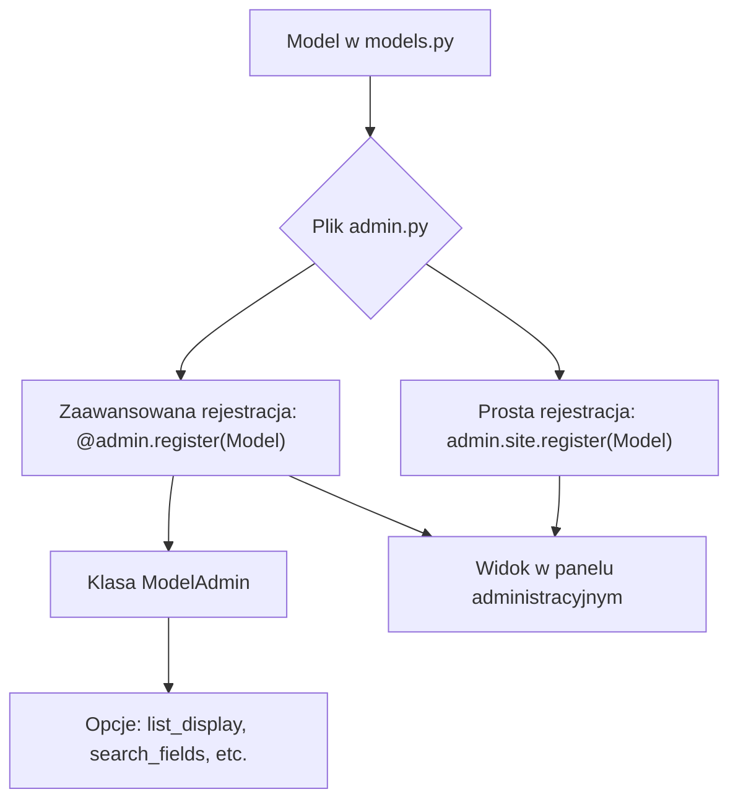
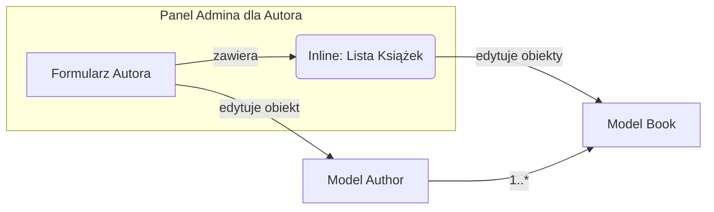
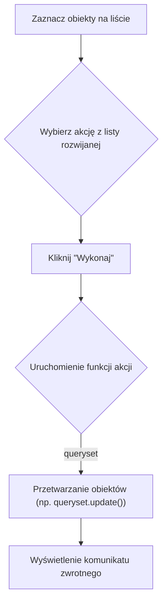
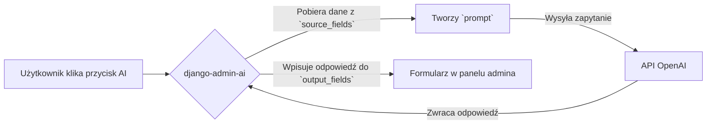

# **Lekcja 23: Konfiguracja panelu administracyjnego Django**

`#lekcja` `#python` `#django` `#backend` `#admin`

Witaj na kolejnej lekcji! Do tej pory nauczyliśmy się tworzyć modele, widoki i szablony w Django. Dziś skupimy się na jednym z najpotężniejszych narzędzi, jakie oferuje ten framework – panelu administracyjnym. Domyślnie jest on bardzo funkcjonalny, ale jego prawdziwa siła tkwi w możliwościach dostosowania go do własnych potrzeb.

W tej lekcji nauczymy się, jak modyfikować wygląd i działanie panelu admina, aby praca z danymi była szybsza, wygodniejsza i bardziej intuicyjna.

## **1. Rejestracja modeli i klasa `ModelAdmin`**

Zanim zaczniemy cokolwiek konfigurować, nasz model musi być "widoczny" dla panelu administracyjnego. Robimy to w pliku `admin.py` wewnątrz naszej aplikacji.

> [!definition]
> 
> Plik admin.py to miejsce, w którym definiujemy, jak nasze modele mają być reprezentowane i jak mają się zachowywać w panelu administracyjnym Django. Każda aplikacja w projekcie ma swój własny plik admin.py.

Najprostsza rejestracja modelu wygląda tak:

```python
# blog/admin.py

from django.contrib import admin
from .models import Post

# Rejestrujemy model Post, aby był dostępny w panelu admina
admin.site.register(Post)
```

Aby uzyskać dostęp do zaawansowanych opcji konfiguracyjnych, musimy stworzyć specjalną klasę, która dziedziczy po `admin.ModelAdmin`, a następnie zarejestrować model razem z tą klasą.

```python
# blog/admin.py

from django.contrib import admin
from .models import Post

# Tworzymy klasę konfiguracyjną dla modelu Post
class PostAdmin(admin.ModelAdmin):
    # Tutaj będziemy dodawać wszystkie opcje konfiguracyjne
    pass

# Rejestrujemy model Post, łącząc go z klasą PostAdmin
admin.site.register(Post, PostAdmin)
```

> [!tip]
> 
> Lepszym i bardziej nowoczesnym sposobem rejestracji jest użycie dekoratora @admin.register(). Jest to składniowo czytelniejszy odpowiednik admin.site.register().

```python
# blog/admin.py

from django.contrib import admin
from .models import Post

@admin.register(Post)
class PostAdmin(admin.ModelAdmin):
    pass
```



## **2. Sortowanie, filtry i wyszukiwanie**

Domyślnie, lista obiektów w panelu admina pokazuje tylko wynik metody `__str__` każdego obiektu. Możemy to łatwo zmienić, aby wyświetlać więcej przydatnych informacji w formie tabeli.

> [!info]
> 
> Atrybuty takie jak list_display, list_filter czy search_fields to specjalne zmienne w klasie ModelAdmin, które pozwalają w prosty sposób modyfikować interfejs listy obiektów.

- `list_display`: Określa, które pola modelu mają być wyświetlane jako kolumny na liście obiektów.
    
- `list_filter`: Dodaje panel z filtrami po prawej stronie, pozwalający na filtrowanie obiektów po wartościach z podanych pól.
    
- `search_fields`: Dodaje pole wyszukiwania, które przeszukuje zdefiniowane kolumny.
    
- `ordering`: Określa domyślne sortowanie listy obiektów.
    

```python
# users/admin.py
from django.contrib import admin
from .models import CustomUser

@admin.register(CustomUser)
class CustomUserAdmin(admin.ModelAdmin):
    # Wyświetlamy te kolumny w panelu admina
    list_display = ('username', 'email', 'first_name', 'last_name', 'is_staff', 'date_joined')
    
    # Dodajemy możliwość filtrowania po statusie personelu i dacie dołączenia
    list_filter = ('is_staff', 'is_superuser', 'date_joined')
    
    # Dodajemy pole wyszukiwania, które przeszukuje username i email
    search_fields = ('username', 'email')
    
    # Domyślnie sortujemy użytkowników po dacie dołączenia (malejąco)
    ordering = ('-date_joined',)
```

## **3. Wyświetlanie powiązanych modeli (Inline)**

Czasami chcemy edytować powiązane ze sobą obiekty na jednym ekranie. Na przykład, podczas edycji Autora chcielibyśmy od razu dodawać lub modyfikować jego Książki.

> [!definition]
> 
> Inline to mechanizm w panelu admina Django, który pozwala na wyświetlanie i edycję obiektów z modelu powiązanego (np. przez ForeignKey) bezpośrednio w widoku edycji obiektu nadrzędnego.

Istnieją dwa główne typy inline:

- `admin.TabularInline`: Wyświetla powiązane obiekty w zwartej, tabelarycznej formie.
    
- `admin.StackedInline`: Wyświetla każdy powiązany obiekt w osobnym, pełnym bloku formularza.
    

Załóżmy, że mamy modele `Author` i `Book`, gdzie `Book` ma klucz obcy do `Author`.

```python
# books/models.py
from django.db import models

class Author(models.Model):
    name = models.CharField(max_length=100)
    # ...

class Book(models.Model):
    title = models.CharField(max_length=200)
    author = models.ForeignKey(Author, on_delete=models.CASCADE, related_name='books')
    # ...
```

Aby wyświetlić książki na stronie autora, robimy tak:

```python
# books/admin.py
from django.contrib import admin
from .models import Author, Book

class BookInline(admin.TabularInline):
    # Określamy, jaki model będzie wyświetlany
    model = Book
    # Ilość dodatkowych, pustych formularzy do dodania nowych obiektów
    extra = 1

@admin.register(Author)
class AuthorAdmin(admin.ModelAdmin):
    list_display = ('name',)
    # Dołączamy inline do widoku admina autora
    inlines = [BookInline]
```




![[Screenshot 2025-09-12 at 17.39.15.png]]


## **4. Wyświetlanie niestandardowych pól, obrazków i linków**

Panel admina może wyświetlać nie tylko pola prosto z bazy danych, ale również wyniki działania metod zdefiniowanych w naszej klasie `ModelAdmin` lub w modelu.

### **Niestandardowe pola**

Możemy stworzyć metodę, która np. łączy imię i nazwisko, a następnie dodać ją do `list_display`.

```python
# users/admin.py
from django.contrib import admin
from .models import CustomUser

@admin.register(CustomUser)
class CustomUserAdmin(admin.ModelAdmin):
    list_display = ('username', 'email', 'full_name')

    # Definiujemy metodę, która będzie źródłem danych dla kolumny 'full_name'
    def full_name(self, obj):
        return f"{obj.first_name} {obj.last_name}"
    
    # Ustawiamy niestandardowy nagłówek dla naszej kolumny
    full_name.short_description = 'Imię i nazwisko'
```

### **Wyświetlanie obrazków i linków**

Aby wyświetlić w panelu admina coś, co nie jest zwykłym tekstem (np. tag HTML `` lub `<a>`), musimy użyć specjalnych narzędzi, aby poinformować Django, że ten kod jest bezpieczny i nie powinien być "czyszczony".

> [!note]
> 
> Używamy funkcji format_html z django.utils.html, aby bezpiecznie wstawić HTML do panelu administracyjnego. Jest to preferowany sposób, ponieważ chroni przed atakami typu Cross-Site Scripting (XSS).

Załóżmy, że nasz model `Car` ma pole `photo` typu `ImageField` i `owner_website` typu `URLField`.

```python
# cars/admin.py
from django.contrib import admin
from django.utils.html import format_html
from .models import Car

@admin.register(Car)
class CarAdmin(admin.ModelAdmin):
    list_display = ('brand', 'model', 'display_photo', 'link_to_owner')

    def display_photo(self, obj):
        if obj.photo:
            # Tworzymy tag . Sprawdzamy, czy zdjęcie istnieje.
            return format_html('', obj.photo.url)
        return "Brak zdjęcia"
    display_photo.short_description = 'Zdjęcie'

    def link_to_owner(self, obj):
        if obj.owner_website:
            # Tworzymy tag <a>
            return format_html('<a href="{0}" target="_blank">{0}</a>', obj.owner_website)
        return "Brak strony"
    link_to_owner.short_description = 'Strona właściciela'
```

## **5. Akcje w panelu administracyjnym (Admin Actions)**

Akcje to operacje, które możemy wykonywać masowo na zaznaczonych obiektach na liście. Domyślnie Django udostępnia akcję "Usuń zaznaczone". Możemy łatwo tworzyć własne.

> [!definition]
> 
> Admin Action to funkcja, którą podłączamy do ModelAdmin, aby wykonywać niestandardowe, masowe operacje na obiektach. Funkcja ta przyjmuje trzy argumenty: modeladmin, request i queryset (zbiór zaznaczonych obiektów).

Stwórzmy akcję, która dla zaznaczonych postów zmieni ich status na "opublikowany".

```python
# blog/admin.py
from django.contrib import admin, messages
from .models import Post

@admin.register(Post)
class PostAdmin(admin.ModelAdmin):
    list_display = ('title', 'status', 'author')
    list_filter = ('status',)
    
    # Lista akcji dostępnych w panelu
    actions = ['make_published']

    def make_published(self, request, queryset):
        # Aktualizujemy pole 'status' dla wszystkich zaznaczonych obiektów
        rows_updated = queryset.update(status='published')
        
        # Wyświetlamy użytkownikowi komunikat o powodzeniu
        self.message_user(request, f'{rows_updated} postów zostało opublikowanych.', messages.SUCCESS)

    # Ustawiamy nazwę, która będzie widoczna na liście akcji
    make_published.short_description = "Oznacz zaznaczone jako opublikowane"
```



## **6. Integracja ze sztuczną inteligencją: `django-admin-ai`**

Wyobraź sobie, że możesz zautomatyzować tworzenie treści, tłumaczenie tekstów czy generowanie podsumowań bezpośrednio w panelu admina. Biblioteka `django-admin-ai` integruje modele językowe (np. GPT od OpenAI) z Twoim panelem, dodając przyciski akcji AI do formularzy edycji.

### **Instalacja i konfiguracja**

1. **Instalacja biblioteki:**
    
    ```
    pip install django-admin-ai openai
    ```
    
2. Dodanie do INSTALLED_APPS:
    
    W pliku settings.py dodaj 'admin_ai' do listy zainstalowanych aplikacji.
    
    ```python
    # settings.py
    INSTALLED_APPS = [
        # ...
        'admin_ai',
        'django.contrib.admin',
        # ...
    ]
    ```
    
3. Konfiguracja klucza API i akcji:
    
    W settings.py musisz dodać swój klucz OpenAI API oraz zdefiniować, jakie akcje AI mają być dostępne dla poszczególnych modeli.
    
    > [!warning]
    > 
    > Nigdy nie umieszczaj klucza API bezpośrednio w kodzie w środowisku produkcyjnym! Używaj zmiennych środowiskowych (np. za pomocą python-decouple lub os.getenv).
    
    ```python
    # settings.py
    import os
    
    # Klucz API OpenAI (najlepiej ze zmiennej środowiskowej)
    ADMIN_AI_OPENAI_API_KEY = os.getenv("OPENAI_API_KEY")
    
    # Konfiguracja akcji AI dla modeli
    ADMIN_AI_CONFIG = {
        'blog.Post': {  # format: 'app_name.ModelName'
            'actions': [
                {
                    'name': 'generate_content',
                    'description': 'Wygeneruj treść posta na podstawie tytułu',
                    'prompt': "Napisz angażujący artykuł na bloga o tytule: '{title}'. Artykuł powinien mieć około 300 słów i być napisany w języku polskim.",
                    'source_fields': ['title'],
                    'output_fields': ['content'],
                },
                {
                    'name': 'translate_to_english',
                    'description': 'Przetłumacz treść na język angielski',
                    'prompt': "Przetłumacz poniższy tekst na język angielski (styl formalny):\n\n{content}",
                    'source_fields': ['content'],
                    'output_fields': ['content_en'], # Zakładając, że model Post ma pole content_en
                },
                {
                    'name': 'suggest_tags',
                    'description': 'Zasugeruj tagi (oddzielone przecinkami)',
                    'prompt': "Na podstawie tytułu '{title}' i treści '{content}', zasugeruj 5-7 trafnych tagów. Zwróć je jako listę oddzieloną przecinkami, np. 'technologia, programowanie, ai'.",
                    'source_fields': ['title', 'content'],
                    'output_fields': ['tags'], # Zakładając, że model Post ma pole tags
                }
            ]
        }
    }
    ```
    

### **Jak to działa?**

Po skonfigurowaniu, `django-admin-ai` automatycznie dodaje przyciski do strony edycji obiektu w panelu administracyjnym. Nie musisz modyfikować pliku `admin.py`!

- **`prompt`**: To szablon polecenia, które zostanie wysłane do modelu AI. W nawiasach klamrowych `{}` podajesz nazwy pól, których wartości zostaną wstawione do polecenia.
    
- **`source_fields`**: Lista pól, z których pobierane są dane do uzupełnienia `promptu`.
    
- **`output_fields`**: Lista pól, do których zostanie wstawiona odpowiedź od AI.
    

Kiedy użytkownik kliknie przycisk, na przykład "Wygeneruj treść posta na podstawie tytułu":

1. Biblioteka pobierze wartość z pola `title`.
    
2. Wstawi ją do zdefiniowanego `promptu`.
    
3. Wyśle gotowe polecenie do API OpenAI.
    
4. Otrzymaną odpowiedź wpisze do pola `content`.
    




![[Screenshot 2025-09-12 at 17.40.11.png]]


To potężne narzędzie, które może drastycznie przyspieszyć pracę redaktorów i administratorów treści, automatyzując najbardziej żmudne zadania.

## **7. 🧪 Zadania do samodzielnej pracy**

W ramach zadań stwórz nową aplikację Django o nazwie `cars`. W niej zdefiniuj model `Car` z następującymi polami:

- `brand` (CharField)
    
- `model` (CharField)
    
- `year` (IntegerField)
    
- `price` (DecimalField)
    
- `description` (TextField)
    
- `photo` (ImageField) - wymaga konfiguracji `MEDIA_ROOT` i `MEDIA_URL` w `settings.py`
    
- `owner_website` (URLField, może być puste)
    
- `is_available` (BooleanField, domyślnie True)
    

### **Zadania proste**

1. ✏️ Zadanie 1 – Podstawowa rejestracja
    
    Zarejestruj model Car w panelu administracyjnym, tak aby był w nim widoczny. Użyj najprostszej metody admin.site.register().
    
    (proste)
    
2. ✏️ Zadanie 2 – Konfiguracja kolumn
    
    Stwórz klasę CarAdmin i zarejestruj model Car z jej pomocą (używając dekoratora). W list_display wyświetl tylko markę, model, rok produkcji oraz status dostępności (is_available).
    
    (proste)
    
3. ✏️ Zadanie 3 – Dodanie wyszukiwania
    
    Do klasy CarAdmin dodaj search_fields, aby umożliwić wyszukiwanie samochodów po marce i modelu.
    
    (proste)
    
4. ✏️ Zadanie 4 – Dodanie filtrów
    
    Dodaj list_filter, aby można było filtrować samochody po polu is_available oraz year.
    
    (proste)
    
5. ✏️ Zadanie 5 – Domyślne sortowanie
    
    Ustaw domyślne sortowanie (ordering) listy samochodów od najnowszego rocznika do najstarszego.
    
    (proste)
    

### **Zadania "Challenge"**

6. 🧠 Zadanie 6 – Pole generowane dynamicznie
    
    Stwórz w CarAdmin niestandardową metodę full_name, która zwróci połączony string z marki i modelu (np. "Ford Mustang"). Dodaj tę metodę do list_display i ustaw jej nagłówek (short_description) na "Pełna nazwa".
    
    (challenge)
    
7. 🧠 Zadanie 7 – Pole tylko do odczytu
    
    W panelu admina, w widoku edycji pojedynczego samochodu, spraw, aby pole year było polem tylko do odczytu (readonly_fields).
    
    (challenge)
    
8. 🧠 Zadanie 8 – Własna akcja
    
    Stwórz niestandardową akcję (Admin Action) o nazwie "Oznacz jako niedostępne" (mark_as_unavailable), która dla zaznaczonych samochodów ustawi pole is_available na False. Nie zapomnij o komunikacie dla użytkownika.
    
    (challenge)
    
9. 🧠 Zadanie 9 – Wyświetlanie miniaturki zdjęcia
    
    W widoku listy (list_display) w CarAdmin wyświetl miniaturkę zdjęcia z pola photo. Pamiętaj o bezpieczeństwie i użyj format_html. Ustaw szerokość obrazka na 150 pikseli.
    
    (challenge)
    
10. 🧠 Zadanie 10 – Model powiązany i Inline
    
    Stwórz drugi model, Dealer, z polami name (CharField) i address (TextField). Połącz model Car z Dealer relacją ForeignKey. Następnie w panelu admina dla Dealera, wyświetl wszystkie przypisane do niego samochody w formie TabularInline.
    
    (challenge)