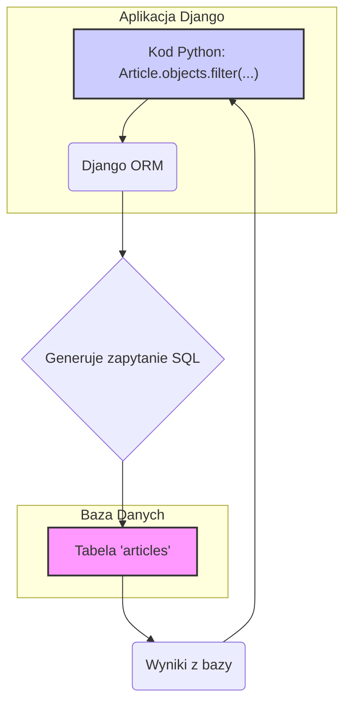

# **Lekcja 22: Zaawansowana Praca z Bazą Danych w Django**

`#lekcja` `#python` `#django` `#orm` `#bazydanych` `#queryset` `#faker`

Witaj na kolejnej lekcji! Dzisiaj zagłębimy się w bardziej zaawansowane, ale niezwykle ważne aspekty pracy z bazami danych w Django. Nauczymy się, jak projektować strukturę danych w sposób profesjonalny (normalizacja), jak efektywnie odpytywać bazę za pomocą `QuerySet` oraz jak automatycznie generować dane testowe, co ogromnie przyspiesza pracę nad projektem. Zaczynajmy!

## **1. Normalizacja Bazy Danych**

Kiedy projektujemy modele w Django, tak naprawdę projektujemy strukturę naszej bazy danych. Jednym z kluczowych pojęć w projektowaniu baz danych jest normalizacja.

> [!definition]
> 
> Normalizacja bazy danych to proces organizowania danych w celu zminimalizowania ich redundancji (powtarzania się). Innymi słowy, chodzi o to, by te same informacje nie były przechowywane w wielu miejscach jednocześnie. Prawidłowa normalizacja prowadzi do bardziej elastycznej, wydajnej i bezbłędnej bazy danych.

### Dlaczego normalizacja jest ważna?

Wyobraźmy sobie, że tworzymy aplikację do zarządzania sklepem meblowym. Mamy model `Produkt`, który przechowuje nazwę produktu i materiał, z którego jest wykonany.

**Problem: Brak normalizacji**

Nasza tabela w bazie danych mogłaby wyglądać tak:

|   |   |
|---|---|
|**Nazwa Produktu**|**Materiał**|
|Stół|Masyw dębowy|
|Krzesło|Plastik|
|Szafa|Masyw dębowy|
|Regał|Płyta MDF|
|Komoda|Masyw dębowy|

Co się stanie, jeśli będziemy chcieli zmienić nazwę materiału "Masyw dębowy" na "Drewno dębowe"? Musielibyśmy zaktualizować **wszystkie trzy wiersze**, w których ten materiał występuje. Jeśli o którymś zapomnimy, w naszej bazie pojawią się niespójne dane. To jest tzw. **anomalia aktualizacji**.

**Rozwiązanie: Normalizacja**

Zamiast przechowywać nazwę materiału jako tekst w tabeli produktów, tworzymy osobną tabelę (model) `Material` i łączymy je relacją.

```
erDiagram
    PRODUKT ||--o{ MATERIAL : "wykonany z"

    PRODUKT {
        string nazwa_produktu
    }
    MATERIAL {
        string nazwa_materialu
    }
```

W Django zaimplementowalibyśmy to za pomocą `ForeignKey`:

```python
# models.py

from django.db import models

class Material(models.Model):
    nazwa_materialu = models.CharField(max_length=100, unique=True)

    def __str__(self):
        return self.nazwa_materialu

class Produkt(models.Model):
    nazwa_produktu = models.CharField(max_length=200)
    # Tworzymy relację "wiele do jednego" z modelem Material
    # Każdy produkt ma jeden materiał, ale jeden materiał może mieć wiele produktów
    material = models.ForeignKey(Material, on_delete=models.CASCADE)

    def __str__(self):
        return self.nazwa_produktu
```

Teraz, jeśli chcemy zmienić nazwę materiału, robimy to tylko w jednym miejscu – w tabeli `Material`. Wszystkie produkty powiązane z tym materiałem automatycznie odziedziczą nową nazwę.

> [!info]
> 
> Dzięki normalizacji unikamy redundancji danych, zapobiegamy anomaliom i ułatwiamy zarządzanie danymi. ForeignKey, ManyToManyField i OneToOneField w Django to Twoje główne narzędzia do implementacji znormalizowanej struktury bazy danych.

## **2. QuerySet - Potęga Zapytań w Django**

Już wiemy, że Django ORM pozwala nam komunikować się z bazą danych za pomocą Pythona. Sercem tej komunikacji jest `QuerySet`.

> [!definition]
> 
> QuerySet to w uproszczeniu lista obiektów (rekordów) danego modelu pobranych z bazy danych. Django dostarcza bogaty zestaw metod (API), które pozwalają na filtrowanie, sortowanie i modyfikowanie QuerySet zanim dane zostaną faktycznie pobrane z bazy.



### Podstawowe operacje na QuerySet

Załóżmy, że mamy model `Article` w naszej aplikacji blogowej.

```python
# Pobranie wszystkich artykułów
# Zwraca QuerySet zawierający wszystkie obiekty Article
wszystkie_artykuly = Article.objects.all()

# Wyświetlenie liczby artykułów
print(wszystkie_artykuly.count())
```

```python
# Filtrowanie danych
# Zwraca QuerySet zawierający tylko opublikowane artykuły
opublikowane_artykuly = Article.objects.filter(status='published')

# Filtrowanie po autorze o konkretnym ID
artykuly_autora_1 = Article.objects.filter(author_id=1)

# Można łączyć warunki
opublikowane_artykuly_autora_1 = Article.objects.filter(status='published', author_id=1)
```

```python
# Sortowanie i ograniczanie wyników
# Pobierz 5 najnowszych artykułów
najnowsze_artykuly = Article.objects.order_by('-publication_date')[:5]
# Znak minusa ('-') oznacza sortowanie malejące

# Wykluczanie wyników
# Pobierz wszystkie artykuły oprócz roboczych
artykuly_bez_roboczych = Article.objects.exclude(status='draft')
```

> [!tip]
> 
> QuerySety są leniwe (Lazy)! Django wykonuje zapytanie do bazy danych dopiero wtedy, gdy jest to absolutnie konieczne – na przykład, gdy próbujesz iterować po QuerySet, wyświetlić go lub wywołać na nim len(). To mechanizm optymalizacyjny, który zapobiega niepotrzebnym zapytaniom do bazy danych.

## **3. Migracje - Synchronizacja Modeli z Bazą (Przypomnienie)**

Każda zmiana w pliku `models.py` (dodanie modelu, pola, zmiana relacji) musi zostać odzwierciedlona w strukturze bazy danych. Do tego właśnie służą migracje.

> [!note]
> 
> Proces migracji jest dwuetapowy:
> 
> 1. **Tworzenie pliku migracji:** Django analizuje zmiany w modelach i generuje plik z instrukcjami, jak zaktualizować bazę danych.
>     
> 2. **Aplikowanie migracji:** Django wykonuje instrukcje z pliku migracji na bazie danych, fizycznie zmieniając jej strukturę.
>     

```python
# Krok 1: Tworzy nowy plik migracji w katalogu migrations/
# Uruchom tę komendę po każdej zmianie w models.py
python manage.py makemigrations

# Krok 2: Aplikuje wszystkie niezaaplikowane migracje do bazy danych
python manage.py migrate
```

## **4. Seeder / Faker - Wypełnianie Bazy Danych Danymi Testowymi**

Podczas tworzenia aplikacji ciągle potrzebujemy danych do testowania – postów na blogu, użytkowników, komentarzy itd. Ręczne ich dodawanie przez panel admina jest czasochłonne i nużące. Z pomocą przychodzą narzędzia do automatycznego generowania danych.

> [!definition]
> 
> Seeder to skrypt, którego zadaniem jest "zasianie" (ang. to seed) bazy danych, czyli wypełnienie jej początkowymi, najczęściej testowymi danymi. Do generowania losowych, ale realistycznie wyglądających danych (imiona, adresy, tekst) często używa się biblioteki Faker.

### Jak stworzyć seeder w Django?

Najlepszym sposobem jest stworzenie własnej komendy dla `manage.py`.

**Krok 1: Instalacja Fakera**

```bash
pip install Faker
```

**Krok 2: Struktura katalogów dla komendy**

Wewnątrz swojej aplikacji (np. `blog`) utwórz następującą strukturę katalogów i plików:

```bash
blog/
├── management/
│   ├── __init__.py
│   └── commands/
│       ├── __init__.py
│       └── seed_data.py  <-- Nasz skrypt
├── migrations/
├── __init__.py
├── admin.py
├── apps.py
├── models.py
├── tests.py
└── views.py
```

**Krok 3: Napisanie skryptu seedującego (`seed_data.py`)**

```python
# blog/management/commands/seed_data.py

import random
from django.core.management.base import BaseCommand
from faker import Faker
from blog.models import Author, Post # Załóżmy, że mamy takie modele

class Command(BaseCommand):
    help = 'Seeds the database with sample data'

    def handle(self, *args, **kwargs):
        self.stdout.write('Seeding data...')

        # Inicjalizujemy Faker
        fake = Faker('pl_PL') # Używamy polskiego wariantu

        # Stwórzmy 10 autorów
        authors = []
        for _ in range(10):
            author = Author.objects.create(
                name=fake.name(),
                email=fake.email()
            )
            authors.append(author)
        
        self.stdout.write(self.style.SUCCESS(f'{len(authors)} authors created.'))

        # Stwórzmy 50 postów
        posts = []
        for _ in range(50):
            post = Post.objects.create(
                title=fake.sentence(nb_words=6),
                content=' '.join(fake.paragraphs(nb=5)),
                author=random.choice(authors), # Losowy autor z listy
                publication_date=fake.date_time_this_year()
            )
            posts.append(post)

        self.stdout.write(self.style.SUCCESS(f'{len(posts)} posts created.'))
        self.stdout.write(self.style.SUCCESS('Data seeding complete.'))

```

**Krok 4: Uruchomienie komendy**

Teraz możesz wypełnić bazę danych jedną, prostą komendą:

```bash
python manage.py seed_data
```

## **5. Moduły (Aplikacje) Zewnętrzne w Django**

Ekosystem Django jest ogromny. Zamiast pisać wszystko od zera, często możemy skorzystać z gotowych, zewnętrznych aplikacji (modułów), które rozwiązują powszechne problemy (np. rejestracja użytkowników, formularze, API).

Proces instalacji jest zwykle taki sam:

1. Instalacja paczki za pomocą `pip`.
    
2. Dodanie nazwy aplikacji do listy `INSTALLED_APPS` w `settings.py`.
    
3. Ewentualna dodatkowa konfiguracja (np. w `urls.py`).
    

Przykłady popularnych modułów:

- `django-crispy-forms` - do łatwego renderowania pięknych formularzy.
    
- `django-allauth` - kompletne rozwiązanie do rejestracji, logowania i logowania przez media społecznościowe.
    
- `djangorestframework` - do budowy potężnych REST API.
    

## **🧪 Zadania do samodzielnej pracy**

Kontynuujemy pracę nad naszą aplikacją blogową.

### Zadania proste:

1. ✏️ Zadanie 1 – Normalizacja Postów (Kategorie)
    
    Stwórz nowy model Category z polem name. Następnie w modelu Post dodaj pole category będące kluczem obcym (ForeignKey) do modelu Category. Nie zapomnij o stworzeniu i zaaplikowaniu migracji! (proste)
    
2. ✏️ Zadanie 2 – Widok Kategorii
    
    Napisz widok, który po wejściu na URL /category/<category_id>/ wyświetli listę wszystkich postów należących do danej kategorii. Użyj metody filter() na QuerySet. (proste)
    
3. ✏️ Zadanie 3 – Ostatnie Posty na Stronie Głównej
    
    Zmodyfikuj widok strony głównej tak, aby wyświetlał tylko 5 najnowszych postów. Użyj order_by() i "krojenia" (slicing) QuerySetu. (proste)
    
4. ✏️ Zadanie 4 – Instalacja Fakera
    
    W swoim wirtualnym środowisku zainstaluj bibliotekę Faker za pomocą pip. (proste)
    
5. ✏️ Zadanie 5 – Testowanie Fakera
    
    Napisz prosty, samodzielny skrypt .py (poza projektem Django), który importuje Faker i drukuje w konsoli 10 losowych polskich imion i nazwisk oraz 10 losowych zdań. (proste)
    

### Zadania-wyzwania:

6. 🧠 Zadanie 6 – Wyszukiwarka Postów
    
    Stwórz prostą wyszukiwarkę. Dodaj formularz na stronie głównej, który wysyła zapytanie GET z frazą szukaną. Stwórz widok, który odbierze tę frazę i odfiltruje posty, których tytuł lub treść zawiera daną frazę (__icontains będzie tu bardzo pomocne). (challenge)
    
7. 🧠 Zadanie 7 – Seeder dla Kategorii i Postów
    
    Stwórz własną komendę manage.py o nazwie seed_blog. Komenda powinna:
    
    a. Usunąć wszystkie istniejące posty i kategorie.
    
    b. Stworzyć 5-10 predefiniowanych kategorii (np. "Technologia", "Podróże", "Kulinaria").
    
    c. Stworzyć 100 losowych postów za pomocą Faker i losowo przypisać każdy z nich do jednej z nowo utworzonych kategorii. (challenge)
    
8. 🧠 Zadanie 8 – Normalizacja Postów (Tagi)
    
    Zaprojektuj i zaimplementuj system tagów. Stwórz model Tag z polem name. Post może mieć wiele tagów, a tag może być przypisany do wielu postów. Jakiego pola relacyjnego użyjesz w modelu Post? (podpowiedź: ManyToManyField). Pamiętaj o migracjach. (challenge)
    
9. 🧠 Zadanie 9 – Rozbudowa Seedera o Tagi
    
    Rozbuduj swoją komendę seed_blog. Po stworzeniu postów, skrypt powinien losowo przypisać od 1 do 5 istniejących tagów do każdego posta. (challenge)
    
10. 🧠 Zadanie 10 – Rejestracja i Logowanie
    
    Zintegruj z projektem zewnętrzną aplikację do obsługi użytkowników, np. django-allauth. Skonfiguruj ją tak, aby użytkownicy mogli się rejestrować i logować. To duże zadanie, które wymaga czytania dokumentacji, ale jest to kluczowa umiejętność w pracy z frameworkami. (challenge)