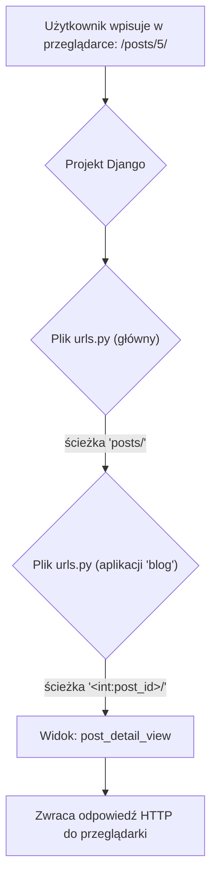
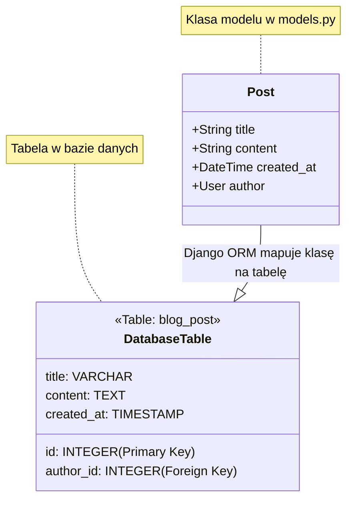
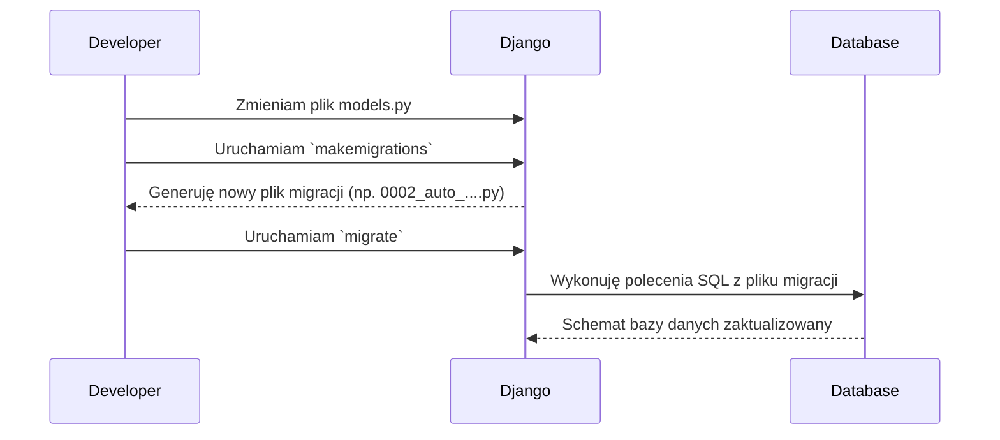

# **Lekcja 20: Django - Widoki, Modele i Szablony**

`#lekcja` `#python` `#django` `#webdev` `#backend`

Witaj na kolejnej lekcji! Po zapoznaniu się z podstawami konfiguracji projektu Django, nadszedł czas, aby zagłębić się w jego kluczowe elementy. W tej lekcji omówimy, jak Django obsługuje zapytania od użytkowników, jak komunikuje się z bazą danych i jak generuje dynamiczne strony HTML. Zbudujemy fundamenty pod naszą pierwszą prawdziwą aplikację webową!

## **1. Routing i obsługa zapytań**

Każda interakcja w aplikacji webowej zaczyna się od zapytania HTTP, które trafia na konkretny adres URL. Zadaniem systemu routingu (lub inaczej "URL dispatchera") jest skierowanie tego zapytania do odpowiedniej funkcji lub klasy w naszym kodzie, która je obsłuży.

> [!definition]
> 
> Routing (trasowanie) w Django to mechanizm, który na podstawie adresu URL w zapytaniu decyduje, który fragment kodu (nazywany widokiem) powinien zostać wykonany. Konfiguracja routingu znajduje się w plikach urls.py.

W Django możemy wyróżnić kilka rodzajów "ścieżek" (routes):

- **Statyczne** – mają stały, niezmienny adres, np. `/about/` lub `/contact/`.
    
- **Dynamiczne** – zawierają zmienne fragmenty, które pozwalają na wyświetlanie różnych danych pod podobnym adresem, np. `/posts/1/` i `/posts/2/` mogą używać tej samej logiki, zmieniając tylko ID posta.
    
- **Wbudowane** – bardziej złożone, mogą zawierać inne konfiguracje URL, co pomaga w modularyzacji aplikacji.
    



### **Przykłady konfiguracji URL**

Konfigurację ścieżek definiujemy w liście `urlpatterns` w pliku `urls.py`.

```python
# Gdzieś w pliku urls.py
from django.urls import path
from . import views # Importujemy nasze widoki

urlpatterns = [
    # 1. Przykład trasy statycznej
    # Adres: /about/
    # Wywoła widok o nazwie 'about_view'
    path('about/', views.about_view, name='about'),

    # 2. Przykład trasy dynamicznej
    # Adres: /products/123/
    # Przechwytuje liczbę całkowitą z URL i przekazuje ją do widoku jako argument 'product_id'
    path('products/<int:product_id>/', views.product_detail_view, name='product-detail'),

    # 3. Przykład trasy wbudowanej (nested)
    # Adres: /api/v1/users/
    # Często używane do grupowania powiązanych ze sobą ścieżek
    # Tutaj zakładamy, że istnieje inny plik urls.py w aplikacji 'api'
    # path('api/', include('api.urls')),
]
```

> [!tip]
> 
> Używanie name w funkcji path() jest bardzo dobrą praktyką. Pozwala to na odwoływanie się do danej ścieżki w innych częściach aplikacji (np. w szablonach) za pomocą jej nazwy, a nie "na sztywno" wpisanego adresu URL. Jeśli zmienisz URL, nie musisz go poprawiać w całej aplikacji!

## **2. Widoki (Views)**

Gdy system routingu dopasuje URL do wzorca, przekazuje zapytanie do odpowiedniego **widoku**. Widok to serce logiki aplikacji – to tutaj decydujemy, co ma się stać w odpowiedzi na zapytanie użytkownika.

> [!definition]
> 
> Widok (View) to funkcja lub klasa w Pythonie, która przyjmuje obiekt zapytania HTTP (request) i zwraca obiekt odpowiedzi HTTP (HttpResponse). Widok jest pośrednikiem między modelami (danymi) a szablonami (prezentacją).

W Django widoki można pisać na dwa główne sposoby:

1. **Widoki oparte na funkcjach (Function-Based Views - FBV)** – proste funkcje, idealne na początek i do prostych zadań.
    
2. **Widoki oparte na klasach (Class-Based Views - CBV)** – klasy, które dziedziczą po wbudowanych w Django klasach widoków. Oferują większą reużywalność kodu i są świetne do bardziej złożonych, standardowych operacji (np. wyświetlanie listy obiektów, formularze).
    

### **Przykład widoku opartego na funkcji (FBV)**

```python
# Gdzieś w pliku views.py
from django.http import HttpResponse

# Prosty widok, który zwraca tekst jako odpowiedź
def hello_world_view(request):
    # Możemy tutaj dodać dowolną logikę
    # np. pobrać coś z bazy danych, przetworzyć dane
    return HttpResponse("<h1>Witaj, świecie!</h1>")

# Widok obsługujący dynamiczny URL
def product_detail_view(request, product_id):
    # Argument 'product_id' pochodzi bezpośrednio z konfiguracji URL
    # <int:product_id>
    return HttpResponse(f"<h1>Wyświetlam produkt o ID: {product_id}</h1>")
```

### **Przykład widoku opartego na klasie (CBV)**

```python
# Gdzieś w pliku views.py
from django.http import HttpResponse
from django.views import View

class MySimpleView(View):
    # Metoda 'get' jest wywoływana dla zapytań HTTP GET
    def get(self, request):
        # Logika dla zapytania GET
        return HttpResponse("To jest odpowiedź z widoku opartego na klasie!")

# Aby użyć tego widoku w urls.py, musimy wywołać metodę .as_view()
# path('my-view/', views.MySimpleView.as_view(), name='class-based-view'),
```

## **3. Modele i Django ORM**

Aplikacje webowe prawie zawsze potrzebują miejsca do przechowywania danych – bazy danych. Django upraszcza pracę z bazą dzięki wbudowanemu mechanizmowi **ORM**.

> [!definition]
> 
> ORM (Object-Relational Mapping) to technika programistyczna, która pozwala na pracę z relacyjną bazą danych (np. PostgreSQL) za pomocą obiektów i klas w języku programowania (w naszym przypadku w Pythonie). Zamiast pisać zapytania SQL, operujemy na obiektach.
> 
> **Model** w Django to klasa Pythona, która reprezentuje jedną tabelę w bazie danych. Każdy atrybut tej klasy odpowiada jednej kolumnie w tabeli.



### **Przykład prostego modelu**

Modele definiujemy w pliku `models.py` wewnątrz naszej aplikacji.

```python
# Gdzieś w pliku models.py
from django.db import models
from django.contrib.auth.models import User # Importujemy model użytkownika

class Post(models.Model):
    # CharField to pole tekstowe o ograniczonej długości
    title = models.CharField(max_length=200)
    # TextField to pole na dłuższy tekst
    content = models.TextField()
    # DateTimeField przechowuje datę i czas. auto_now_add=True automatycznie ustawi datę utworzenia.
    created_at = models.DateTimeField(auto_now_add=True)
    # ForeignKey tworzy relację "wiele do jednego". Jeden użytkownik może mieć wiele postów.
    # on_delete=models.CASCADE oznacza, że jeśli użytkownik zostanie usunięty, jego posty również.
    author = models.ForeignKey(User, on_delete=models.CASCADE)

    # Ta metoda definiuje, jak obiekt będzie wyświetlany, np. w panelu admina
    def __str__(self):
        return self.title
```

Dzięki ORM, zamiast pisać `SELECT * FROM blog_post;`, możemy w Pythonie napisać: `Post.objects.all()`.

## **4. Migracje**

Po zdefiniowaniu lub zmianie modelu musimy poinformować bazę danych o nowej strukturze. Ten proces nazywa się **migracją**.

> [!definition]
> 
> Migracja to plik generowany przez Django, który zawiera instrukcje (w Pythonie, które tłumaczone są na SQL), jak zmienić schemat bazy danych, aby pasował do aktualnego stanu modeli w kodzie.

Proces migracji składa się z dwóch głównych komend:

1. `python manage.py makemigrations` – Django analizuje zmiany w plikach `models.py` i tworzy nowy plik migracji.
    
2. `python manage.py migrate` – Django wykonuje wszystkie niezaaplikowane migracje, czyli wprowadza zmiany w bazie danych.
    




![[Screenshot 2025-08-25 at 16.10.58.png]]


## **5. Szablony (Templates)**

Do tej pory nasze widoki zwracały prosty tekst. W prawdziwym świecie chcemy zwracać pełne strony HTML. Do tego służą **szablony**.

> [!definition]
> 
> Szablon (Template) to plik tekstowy (zazwyczaj HTML), który zawiera specjalne znaczniki pozwalające na wstawianie dynamicznych danych i używanie prostej logiki (pętle, warunki). Django posiada własny język szablonów, zwany Django Template Language (DTL).

### **Konfiguracja**

Najpierw musimy powiedzieć Django, gdzie szukać naszych szablonów. W pliku `settings.py` w głównym katalogu projektu:

```python
# settings.py
import os
from pathlib import Path

BASE_DIR = Path(__file__).resolve().parent.parent

TEMPLATES = [
    {
        'BACKEND': 'django.template.backends.django.DjangoTemplates',
        # Tutaj dodajemy ścieżkę do naszego folderu z szablonami
        'DIRS': [os.path.join(BASE_DIR, 'templates')],
        'APP_DIRS': True,
        'OPTIONS': {
            # ...
        },
    },
]
```

Następnie w głównym katalogu projektu tworzymy folder `templates`.

### **Język szablonów Django (DTL)**

DTL używa dwóch głównych rodzajów znaczników:

- `{{ zmienna }}` – do wyświetlania wartości zmiennej przekazanej z widoku.
    
- `` – do wykonywania logiki, np. pętli `for` lub warunków `if`.
    

### **Dziedziczenie szablonów**

Jedną z najpotężniejszych cech DTL jest dziedziczenie. Możemy stworzyć bazowy szablon (`base.html`) z całą strukturą strony (nagłówek, stopka, menu), a następnie w innych szablonach rozszerzać go i wypełniać tylko konkretne bloki.

**`templates/base.html`:**

```python
<!DOCTYPE html>
<html lang="pl">
<head>
    <meta charset="UTF-8">
    <title>Moja Strona</title>
</head>
<body>
    <header>
        <h1>Witaj na mojej stronie!</h1>
    </header>
    <main>
        
        <!-- Treść podstrony zostanie wstawiona tutaj -->
        
    </main>
    <footer>
        <p>&copy; 2025 - Kurs Django</p>
    </footer>
</body>
</html>
```

**`templates/home.html`:**

```python


Strona Główna


    <h2>To jest strona główna</h2>
    <p>Witaj, {{ user_name }}!</p>

    <h3>Lista produktów:</h3>
    <ul>
        
            <li>{{ product.name }} - {{ product.price }} PLN</li>
        
            <li>Brak produktów do wyświetlenia.</li>
        
    </ul>

```

### **Renderowanie szablonu w widoku**

Aby użyć szablonu, w widoku używamy funkcji `render`.

```python
# Gdzieś w pliku views.py
from django.shortcuts import render

def home_view(request):
    # Przygotowujemy dane, które chcemy przekazać do szablonu
    context = {
        'user_name': 'Anna',
        'products': [
            {'name': 'Jabłka', 'price': 3.50},
            {'name': 'Banany', 'price': 5.99},
            {'name': 'Truskawki', 'price': 12.00},
        ]
    }
    # Renderujemy szablon 'home.html' i przekazujemy mu dane w słowniku 'context'
    return render(request, 'home.html', context)
```

## **6. Formularze (Forms)**

Obsługa formularzy HTML (walidacja danych, wyświetlanie błędów) może być żmudna. Django Forms automatyzuje ten proces.

> [!definition]
> 
> Formularz Django to klasa, która opisuje pola formularza. Django na jej podstawie potrafi wygenerować kod HTML formularza oraz przeprowadzić walidację danych przesłanych przez użytkownika.

### **Przykład formularza**

Formularze definiujemy w pliku `forms.py` (trzeba go utworzyć) w katalogu aplikacji.

```python
# Gdzieś w pliku forms.py
from django import forms

class ContactForm(forms.Form):
    name = forms.CharField(label='Twoje imię', max_length=100)
    email = forms.EmailField(label='Twój email')
    message = forms.CharField(label='Wiadomość', widget=forms.Textarea)
```

### **Użycie formularza w widoku**

```python
# Gdzieś w pliku views.py
from django.shortcuts import render, redirect
from .forms import ContactForm

def contact_view(request):
    if request.method == 'POST':
        # Jeśli formularz został wysłany, tworzymy instancję z danymi POST
        form = ContactForm(request.POST)
        if form.is_valid():
            # Jeśli dane są poprawne, możemy je przetworzyć
            name = form.cleaned_data['name']
            print(f"Otrzymano wiadomość od: {name}")
            # Przekierowujemy użytkownika, aby uniknąć ponownego wysłania formularza
            return redirect('success-page') # 'success-page' to nazwa URL
    else:
        # Jeśli to zapytanie GET, tworzymy pusty formularz
        form = ContactForm()

    return render(request, 'contact.html', {'form': form})
```

### **Wyświetlanie formularza w szablonie**

**`templates/contact.html`:**

```python



    <h2>Skontaktuj się z nami</h2>
    <form method="post">
         <!-- Ważne zabezpieczenie przed atakami CSRF! -->
        {{ form.as_p }} <!-- Django wygeneruje pola formularza jako paragrafy <p> -->
        <button type="submit">Wyślij</button>
    </form>

```

## **7. Paginacja (Pagination)**

Gdy mamy setki lub tysiące obiektów do wyświetlenia (np. postów na blogu), nie chcemy pokazywać ich wszystkich na jednej stronie. Paginacja pozwala podzielić je na mniejsze części.

> [!definition]
> 
> Paginacja to proces dzielenia dużej ilości danych na osobne strony w celu poprawy wydajności i czytelności interfejsu użytkownika.

Django ma wbudowane narzędzia do paginacji.

### **Przykład paginacji w widoku**

```python
# Gdzieś w pliku views.py
from django.shortcuts import render
from django.core.paginator import Paginator
from .models import Post # Zakładamy, że mamy model Post

def post_list_view(request):
    all_posts = Post.objects.all().order_by('-created_at') # Pobieramy wszystkie posty, najnowsze na górze
    paginator = Paginator(all_posts, 5) # Dzielimy posty na strony, po 5 na każdej

    page_number = request.GET.get('page') # Pobieramy numer strony z URL (np. /posts/?page=2)
    page_obj = paginator.get_page(page_number) # Pobieramy obiekty dla danej strony

    return render(request, 'post_list.html', {'page_obj': page_obj})
```

### **Paginacja w szablonie**

**`templates/post_list.html`:**

```python



    <h2>Lista postów</h2>
    
        <article>
            <h3>{{ post.title }}</h3>
            <p>{{ post.content|truncatewords:20 }}</p> <!-- Wyświetlamy tylko 20 pierwszych słów -->
        </article>
    

    <div class="pagination">
        <span class="step-links">
            
                <a href="?page=1">&laquo; pierwsza</a>
                <a href="?page={{ page_obj.previous_page_number }}">poprzednia</a>
            

            <span class="current">
                Strona {{ page_obj.number }} z {{ page_obj.paginator.num_pages }}.
            </span>

            
                <a href="?page={{ page_obj.next_page_number }}">następna</a>
                <a href="?page={{ page_obj.paginator.num_pages }}">ostatnia &raquo;</a>
            
        </span>
    </div>

```

## **🧪 Zadania do samodzielnej pracy**

1. ✏️ Zadanie 1 – Stwórz statyczne trasy i widoki
    
    Stwórz w swojej aplikacji Django dwie statyczne trasy: /info/ oraz /rules/. Każda z nich powinna prowadzić do osobnego widoku opartego na funkcji, który zwraca prosty tekst w HttpResponse (np. "Informacje o stronie" i "Regulamin").
    
    (proste)
    
2. ✏️ Zadanie 2 – Stwórz dynamiczną trasę
    
    Dodaj dynamiczną trasę /user/<str:username>/, która przyjmie nazwę użytkownika jako ciąg znaków. Stwórz widok, który wyświetli komunikat powitalny, np. "Witaj na profilu, username!".
    
    (proste)
    
3. ✏️ Zadanie 3 – Stwórz prosty model
    
    W pliku models.py stwórz model o nazwie Product. Model powinien mieć trzy pola: name (CharField, max 100 znaków), description (TextField) oraz price (DecimalField, z max_digits=6, decimal_places=2). Nie zapomnij o stworzeniu i zaaplikowaniu migracji.
    
    (proste)
    
4. ✏️ Zadanie 4 – Wyświetl dane w szablonie
    
    Stwórz widok, który pobierze kilka obiektów z bazy danych (możesz je dodać ręcznie przez python manage.py shell). Przekaż te obiekty do szablonu i wyświetl je w formie listy <ul>, używając pętli .
    
    (proste)
    
5. ✏️ Zadanie 5 – Stwórz szablon bazowy
    
    Stwórz plik base.html z podstawową strukturą HTML, zawierający bloki  i . Następnie stwórz drugi szablon, który będzie dziedziczył po base.html i uzupełni te bloki własną treścią.
    
    (proste)
    
6. 🧠 Zadanie 6 – Aplikacja "Notatnik"
    
    Stwórz prostą aplikację do robienia notatek.
    
    1. Zdefiniuj model `Note` z polami `title` (CharField) i `content` (TextField).
        
    2. Stwórz widok, który wyświetli listę wszystkich notatek.
        
    3. Stwórz drugi widok, który wyświetli szczegóły pojedynczej notatki (użyj trasy dynamicznej /note/<int:note_id>/).
        
        (challenge)
        
7. 🧠 Zadanie 7 – Formularz dodawania produktu
    
    Bazując na modelu Product z zadania 3, stwórz formularz Django (ProductForm), który pozwoli na dodawanie nowych produktów. Stwórz widok, który będzie obsługiwał ten formularz (wyświetlanie pustego formularza metodą GET i przetwarzanie danych metodą POST). Po poprawnym zapisaniu produktu, przekieruj użytkownika na stronę z listą produktów.
    
    (challenge)
    
8. 🧠 Zadanie 8 – Połącz modele relacją
    
    Stwórz nowy model Category z jednym polem name (CharField). Następnie zmodyfikuj model Product z zadania 3, dodając do niego pole category typu ForeignKey, które będzie wskazywało na model Category. Pamiętaj o migracjach!
    
    (challenge)
    
9. 🧠 Zadanie 9 – Filtrowanie po kategorii
    
    Rozbuduj aplikację z produktami. Stwórz dynamiczną trasę /category/<int:category_id>/, która wyświetli tylko produkty należące do danej kategorii. W widoku musisz odfiltrować produkty na podstawie category_id przekazanego w URL.
    
    (challenge)
    
10. 🧠 Zadanie 10 – Dodaj paginację do listy notatek
    
    W aplikacji "Notatnik" z zadania 6, zaimplementuj paginację na stronie z listą wszystkich notatek. Ustaw, aby na jednej stronie wyświetlały się maksymalnie 3 notatki. Dodaj w szablonie linki "następna" i "poprzednia".
    
    (challenge)