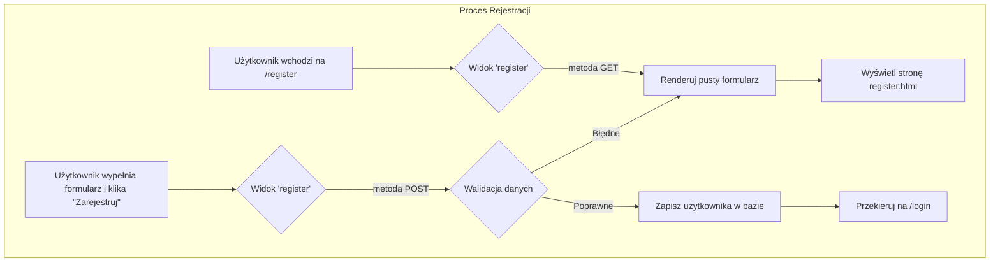
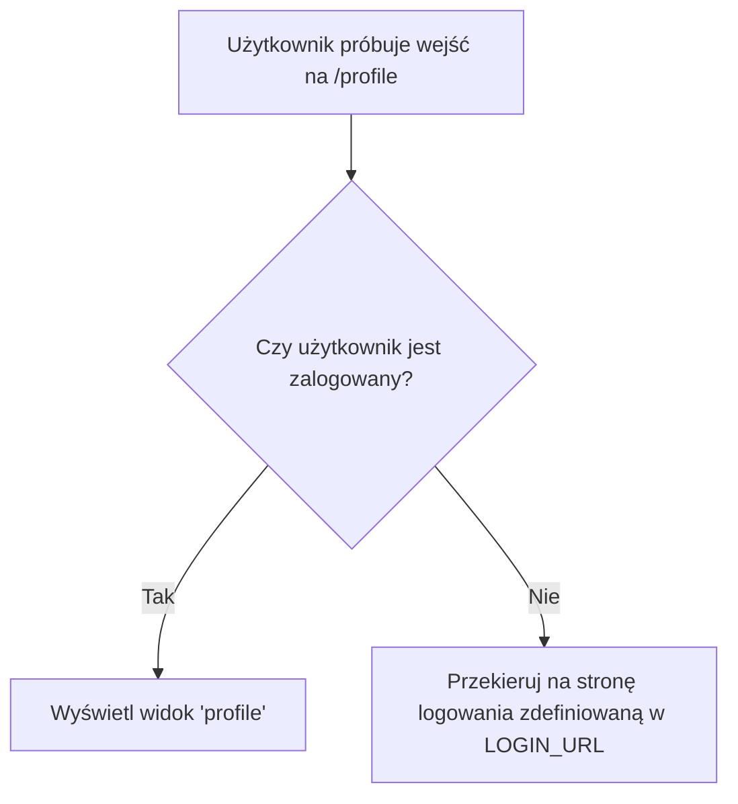

# **Lekcja 24: Uwierzytelnianie i Autoryzacja Użytkowników w Django**

`#lekcja` `#python` `#django` `#webdev` `#backend` `#uwierzytelnianie`

W tej lekcji zajmiemy się jednym z najważniejszych aspektów każdej aplikacji internetowej – systemem logowania, rejestracji i zarządzania sesją użytkownika. Django dostarcza potężny, wbudowany mechanizm, który znacznie upraszcza ten proces, zapewniając jednocześnie wysoki poziom bezpieczeństwa.

## **1. Wbudowany system uwierzytelniania Django**

Każda rozbudowana aplikacja webowa potrzebuje sposobu na weryfikację tożsamości użytkowników i kontrolowanie ich dostępu do różnych zasobów. Django przychodzi z gotowym rozwiązaniem, zwanym "Authentication Framework".

> [!definition]
> 
> Uwierzytelnianie (Authentication) to proces weryfikacji, czy użytkownik jest tym, za kogo się podaje (np. poprzez sprawdzenie loginu i hasła).
> 
> Autoryzacja (Authorization) to proces sprawdzania, czy uwierzytelniony użytkownik ma uprawnienia do wykonania określonej akcji lub dostępu do danego zasobu.

System Django zarządza kontami użytkowników, grupami, uprawnieniami oraz sesjami opartymi na ciasteczkach.

> [!note]
> 
> Korzystanie z wbudowanego systemu Django jest zalecane, ponieważ jest on regularnie testowany i aktualizowany pod kątem bezpieczeństwa. Tworzenie własnego systemu od zera jest skomplikowane i ryzykowne.

Podstawowe elementy systemu to:

- **Model `User`**: Przechowuje informacje o użytkownikach (nazwa, hasło, email itp.).
    
- **Formularze**: Gotowe formularze do rejestracji, logowania i zmiany hasła.
    
- **Widoki**: Wbudowane widoki do obsługi logowania, wylogowywania i zarządzania hasłami.
    
- **Dekoratory**: Narzędzia do łatwego ograniczania dostępu do widoków.
    

## **2. Konfiguracja Rejestracji Użytkownika**

Stworzymy prosty system, który pozwoli nowym użytkownikom na założenie konta w naszej aplikacji. Proces ten składa się z trzech kroków: stworzenia formularza, widoku i szablonu.

> [!info]
> 
> Django udostępnia gotowy formularz UserCreationForm, który idealnie nadaje się do tego zadania. Automatycznie dba o walidację danych i bezpieczne hashowanie hasła.

#### **Krok 1: Tworzenie widoku rejestracji**

W pliku `views.py` naszej aplikacji tworzymy nową funkcję, która będzie obsługiwać logikę rejestracji.

```python
# twoja_aplikacja/views.py
from django.shortcuts import render, redirect
from django.contrib.auth.forms import UserCreationForm
from django.contrib import messages

def register(request):
    # Sprawdzamy, czy metoda żądania to POST (wysyłka formularza)
    if request.method == 'POST':
        # Tworzymy instancję formularza z danymi z żądania
        form = UserCreationForm(request.POST)
        # Sprawdzamy, czy formularz jest poprawny
        if form.is_valid():
            form.save() # Zapisujemy użytkownika w bazie danych
            username = form.cleaned_data.get('username')
            # Wyświetlamy komunikat o sukcesie
            messages.success(request, f'Konto dla {username} zostało utworzone! Możesz się teraz zalogować.')
            return redirect('login') # Przekierowujemy na stronę logowania
    else:
        # Jeśli metoda to GET, tworzymy pusty formularz
        form = UserCreationForm()
    
    # Renderujemy szablon z formularzem
    return render(request, 'users/register.html', {'form': form})
```

#### **Krok 2: Konfiguracja URL**

Musimy dodać ścieżkę do naszego nowego widoku w pliku `urls.py`.

```python
# twoja_aplikacja/urls.py
from django.urls import path
from . import views

urlpatterns = [
    # ... inne ścieżki
    path('register/', views.register, name='register'),
]
```

#### **Krok 3: Stworzenie szablonu**

Teraz potrzebujemy pliku HTML, który wyświetli nasz formularz. Utwórzmy go w `templates/users/register.html`.

```python
<!-- templates/users/register.html -->
 <!-- Zakładając, że masz szablon bazowy -->

    <div class="content-section">
        <form method="POST">
             <!-- Zabezpieczenie CSRF, obowiązkowe! -->
            <fieldset class="form-group">
                <legend class="border-bottom mb-4">Dołącz Już Dziś</legend>
                {{ form.as_p }} <!-- Renderuje pola formularza jako paragrafy -->
            </fieldset>
            <div class="form-group">
                <button class="btn btn-outline-info" type="submit">Zarejestruj się</button>
            </div>
        </form>
        <div class="border-top pt-3">
            <small class="text-muted">
                Masz już konto? <a class="ml-2" href="">Zaloguj się</a>
            </small>
        </div>
    </div>

```



## **3. Logowanie i Wylogowywanie**

Django upraszcza ten proces jeszcze bardziej, dostarczając gotowe widoki oparte na klasach.

> [!tip]
> 
> Korzystanie z wbudowanych widoków LoginView i LogoutView to najlepsza praktyka. Wystarczy je tylko odpowiednio skonfigurować w urls.py.

#### **Konfiguracja URL dla logowania i wylogowywania**

Dodajmy odpowiednie ścieżki w głównym pliku `urls.py` projektu.

```python
# glowny_projekt/urls.py
from django.urls import path, include
from django.contrib.auth import views as auth_views

urlpatterns = [
    # ...
    path('register/', user_views.register, name='register'),
    path('login/', auth_views.LoginView.as_view(template_name='users/login.html'), name='login'),
    path('logout/', auth_views.LogoutView.as_view(template_name='users/logout.html'), name='logout'),
    path('', include('twoja_aplikacja.urls')),
]
```

W powyższym kodzie mówimy Django, żeby użyło wbudowanych widoków, ale wskazało nasze własne szablony.

#### **Ustawienia projektu**

W pliku `settings.py` warto dodać dwie zmienne, które określą, gdzie przekierować użytkownika po udanym logowaniu i gdzie znajduje się strona logowania.

```python
# glowny_projekt/settings.py

# ... na końcu pliku
LOGIN_REDIRECT_URL = 'home' # Nazwa URL, na którą przekierować po zalogowaniu
LOGIN_URL = 'login' # Nazwa URL strony logowania
```

#### **Szablony dla logowania i wylogowania**

Stwórzmy teraz szablony, które zdefiniowaliśmy w `urls.py`.

```python
<!-- templates/users/login.html -->


    <div class="content-section">
        <form method="POST">
            
            <fieldset class="form-group">
                <legend class="border-bottom mb-4">Zaloguj się</legend>
                {{ form.as_p }}
            </fieldset>
            <div class="form-group">
                <button class="btn btn-outline-info" type="submit">Zaloguj</button>
            </div>
        </form>
        <div class="border-top pt-3">
            <small class="text-muted">
                Nie masz konta? <a class="ml-2" href="">Zarejestruj się</a>
            </small>
        </div>
    </div>

```

```python
<!-- templates/users/logout.html -->


    <h2>Zostałeś wylogowany</h2>
    <div class="border-top pt-3">
        <small class="text-muted">
            <a href="">Zaloguj się ponownie</a>
        </small>
    </div>

```

## **4. Zarządzanie Sesją i Stanem Użytkownika**

Kiedy użytkownik się zaloguje, Django tworzy dla niego sesję. Informacje o zalogowanym użytkowniku są dostępne w obiekcie `request` w każdym widoku oraz w zmiennej `user` w szablonach.

> [!definition]
> 
> Sesja to mechanizm pozwalający aplikacji "pamiętać" użytkownika pomiędzy kolejnymi żądaniami HTTP. Django domyślnie przechowuje dane sesji w bazie danych, a w przeglądarce użytkownika umieszcza tylko unikalny identyfikator sesji w ciasteczku (cookie).

Możemy łatwo dostosować interfejs w zależności od tego, czy użytkownik jest zalogowany.

```python
<!-- fragment szablonu base.html -->
<nav>
  
    <a href="">Profil</a>
    <a href="">Wyloguj</a>
    <span>Witaj, {{ user.username }}!</span>
  
    <a href="">Zaloguj</a>
    <a href="">Zarejestruj</a>
  
</nav>
```

Właściwość `user.is_authenticated` zwraca `True`, jeśli użytkownik jest zalogowany, i `False` w przeciwnym wypadku.

## **5. Ograniczanie Dostępu do Widoków**

Często chcemy, aby niektóre strony były dostępne tylko dla zalogowanych użytkowników (np. panel użytkownika, strona profilu). Django udostępnia do tego bardzo prosty w użyciu dekorator.

> [!definition]
> 
> Dekorator w Pythonie to funkcja, która przyjmuje inną funkcję jako argument, dodaje do niej pewną funkcjonalność i zwraca zmodyfikowaną funkcję.

Dekorator `@login_required` sprawdza, czy użytkownik jest zalogowany. Jeśli nie, przekierowuje go na stronę logowania (`LOGIN_URL`).

```python
# twoja_aplikacja/views.py
from django.contrib.auth.decorators import login_required

@login_required
def profile(request):
    # Ten widok będzie dostępny tylko dla zalogowanych użytkowników.
    # Jeśli anonimowy użytkownik spróbuje tu wejść, zostanie
    # automatycznie przekierowany na stronę /login/
    return render(request, 'users/profile.html')
```



## **🧪 Zadania do samodzielnej pracy**

1. ✏️ Zadanie 1 – Konfiguracja settings.py (proste)
    
    W pliku settings.py swojego projektu dodaj zmienne LOGIN_REDIRECT_URL oraz LOGOUT_REDIRECT_URL. Pierwsza powinna wskazywać na stronę główną ('/' lub nazwę URL strony głównej), a druga na stronę logowania.
    
2. ✏️ Zadanie 2 – Linki w nawigacji (proste)
    
    Zmodyfikuj swój szablon bazowy (base.html), aby dynamicznie wyświetlać linki. Jeśli użytkownik jest zalogowany (user.is_authenticated), pokaż linki do "Profilu" i "Wyloguj". Jeśli nie jest zalogowany, pokaż linki "Zaloguj" i "Zarejestruj".
    
3. ✏️ Zadanie 3 – Strona profilu (proste)
    
    Stwórz prosty widok profile, który będzie renderował szablon profile.html. W szablonie wyświetl powitanie, używając nazwy zalogowanego użytkownika, np. <h1>Witaj, {{ user.username }}!</h1>. Zabezpiecz ten widok dekoratorem @login_required.
    
4. ✏️ Zadanie 4 – Komunikaty messages (proste)
    
    Upewnij się, że w Twoim szablonie bazowym (base.html) masz pętlę, która wyświetla komunikaty z frameworka messages Django. Dzięki temu komunikat o pomyślnej rejestracji, który dodaliśmy w widoku, faktycznie się pojawi.
    
    ```python
    
      
        <div class="alert alert-{{ message.tags }}">
          {{ message }}
        </div>
      
    
    ```
    
5. ✏️ Zadanie 5 – Strona główna tylko dla zalogowanych (proste)
    
    Zabezpiecz widok strony głównej Twojej aplikacji za pomocą dekoratora @login_required, tak aby była ona dostępna tylko dla zalogowanych użytkowników.
    

6. 🧠 Zadanie 6 – Rozszerzenie formularza rejestracji (challenge)
    
    Stwórz własny formularz w pliku forms.py, dziedzicząc po UserCreationForm. Dodaj do niego pole email. Następnie w widoku register użyj swojego nowego formularza zamiast domyślnego. Upewnij się, że email jest wymagany i zapisywany w bazie danych.
    
7. 🧠 Zadanie 7 – Przekierowanie po zalogowaniu (challenge)
    
    Zmodyfikuj LoginView tak, aby po zalogowaniu użytkownik był przekierowywany na stronę, z której przyszedł. (Wskazówka: Django robi to domyślnie, jeśli w adresie URL logowania jest parametr next, np. /login/?next=/profile/. Sprawdź, jak to działa w praktyce, próbując wejść na chronioną stronę jako niezalogowany użytkownik). Twoim zadaniem jest opisanie tego mechanizmu.
    
8. 🧠 Zadanie 8 – Zmiana hasła (challenge)
    
    Wykorzystaj wbudowane widoki Django: PasswordChangeView i PasswordChangeDoneView do stworzenia funkcjonalności zmiany hasła przez zalogowanego użytkownika. Będziesz musiał dodać odpowiednie ścieżki w urls.py i stworzyć dwa proste szablony (password_change_form.html i password_change_done.html).
    
9. 🧠 Zadanie 9 – Automatyczne logowanie po rejestracji (challenge)
    
    Zmodyfikuj widok register tak, aby po pomyślnym utworzeniu konta użytkownik był od razu logowany. (Wskazówka: zaimportuj i użyj funkcji login z django.contrib.auth).
    
10. 🧠 Zadanie 10 – Widok tylko dla admina (challenge)
    
    Stwórz widok, który będzie wyświetlał listę wszystkich zarejestrowanych użytkowników (User.objects.all()). Ogranicz dostęp do tego widoku tak, aby mogli go zobaczyć tylko użytkownicy, którzy mają status "staff" (is_staff=True). (Wskazówka: użyj dekoratora @staff_member_required z django.contrib.admin.views.decorators).